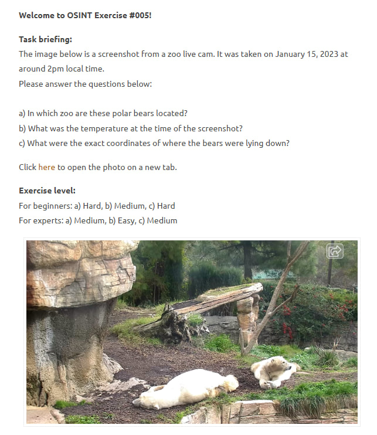

# OSINT Exercise #005 — Zoo Live Cam GEOINT Writeup

## Objective

A single screenshot from a zoo live cam is provided as the only input. The image was captured on January 15, 2023, at approximately 2:00 PM local time. Two polar bears are visible resting in an outdoor enclosure. The goal is to apply open-source and geospatial intelligence techniques to answer three investigative questions.



| # | Question | Difficulty |
|---|----------|------------|
| A | In which zoo are these polar bears located? | Hard |
| B | What was the temperature at the time of the screenshot? | Medium |
| C | What were the exact coordinates of where the bears were lying down? | Hard |

## Walkthrough

### Step 1 — Zoo Identification via Reverse Image Search

The investigation begins with a reverse image search using Google Lens on the original live cam screenshot. The architectural features of the enclosure — distinctive mushroom-shaped rock formations, a wooden log bridge, and the surrounding vegetation — serve as key visual anchors for matching.


Google Lens returned results referencing polar bears at San Diego Zoo. A Change.org petition result confirmed the zoo's polar bears by name: Chinook, Kalluk, and Tatqiq. The enclosure is identified as the *Polar Bear Plunge* exhibit.


Finding — Zoo: **San Diego Zoo**, San Diego, California, USA

### Step 2 — Historical Weather Data Lookup

With the location confirmed as San Diego, CA, historical weather records were queried using the timestamp provided in the task brief.

Search query used:

```
san diego january 15 2023 at 2pm temperature
```


The search returned archived weather data from timeanddate.com for San Diego in January 2023, confirming the conditions at that date and time.

Finding — Temperature: **14°C (57°F)**

### Step 3 — Coordinate Extraction via Google Earth

The live cam screenshot was cross-referenced against satellite imagery in Google Earth to pinpoint the exact resting position of each bear within the enclosure.

**Sub-step 3a — Locating the enclosure**

Using the confirmed zoo name, the *Polar Bear Plunge* enclosure was located in Google Earth's satellite view.


**Sub-step 3b — Matching bear positions to satellite view**

The distinctive rock formations, pool shape, and log bridge visible in the live cam frame were used as reference landmarks to triangulate each bear's position against the aerial view. Directional lines were drawn from identifiable features to the estimated lying positions of both bears.


**Sub-step 3c — Placing and recording coordinates**

Placemarks were dropped in Google Earth at each bear's estimated position and the coordinates were recorded.


Finding — Bear No. 1: `32°44'04.06"N 117°09'16.42"W`


Finding — Bear No. 2: `32°44'03.98"N 117°09'16.49"W`

## Summary of Findings

| Question | Answer |
|----------|--------|
| A — Zoo location | San Diego Zoo, California, USA (*Polar Bear Plunge* exhibit) |
| B — Temperature | 14°C (57°F) |
| C — Bear No. 1 coordinates | 32°44'04.06"N, 117°09'16.42"W |
| C — Bear No. 2 coordinates | 32°44'03.98"N, 117°09'16.49"W |

## Key Observations

- A single image with distinctive architectural features is sufficient to geolocate a subject through reverse image search, without any embedded metadata.
- Publicly available historical weather archives allow precise environmental reconstruction from a known location and timestamp.
- Ground-level camera footage can be correlated with satellite imagery by matching fixed structural landmarks, enabling sub-enclosure coordinate precision.
- The two bears were lying approximately 0.9 meters apart, as estimated from the satellite view.

## About

Completed OSINT Exercise #005 from the series by Sofia Santos ([@gralhix](https://twitter.com/gralhix)) — a geospatial intelligence challenge involving live cam image analysis, historical weather reconstruction, and satellite-based coordinate extraction.

Challenge source: [gralhix.com/list-of-osint-exercises/osint-exercise-005](https://gralhix.com/list-of-osint-exercises/osint-exercise-005/)
